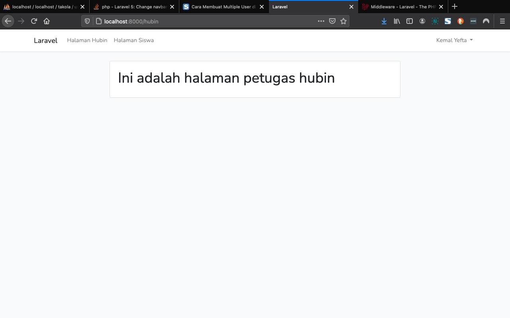

<p align="center"><a href="https://laravel.com" target="_blank"></a></p>

<p align="center">
<a href="https://travis-ci.org/laravel/framework"></a>
<a href="https://packagist.org/packages/laravel/framework"></a>
<a href="https://packagist.org/packages/laravel/framework"></a>
<a href="https://packagist.org/packages/laravel/framework"></a>
</p>

## About Simple Login Multiple User Auth Laravel

Projek ini adalah projek laravel di projek Aplikasi Tata Kelola Surat Menyurat di Sekolah, Level user yang ada dalam projek sederhana ini terdiri dari :

- Level user Admin.
- Level User Petugas Bidang Hubungan Industri (hubin)
- Level User Siswa 
#### belum di buat view
- level user Kepala Program (kaprog)
- level user Wakil kepala Sekolah (waka)

~~ `Level user admin dapat melihat dashboard hubin dan siswa sementara level user hubin dapat melihat dashboard hubin dan siswa , sedangkan siswa hanya dapat melihat dashboard siswa saja` ~~

## 1. Install Laravel

1. Install Laravel
Installah sebuah fresh laravel versi 7 dengan menjalankan perintah berikut ini di terminal atau cmd kalian. 
`composer create-project --prefer-dist laravel/laravel:^7.0 latihan_middleware`   

## 2. Persiapan Database dan Migration

Buatlah sebuah database baru di dalam phpmyadmin dengan nama laravel. Karena nama database yang kita buat adalah laravel, maka kita tidak perlu mengedit file `.env`. Tapi jika kalian ingin nama database yang berbeda, kalian juga harus mengedit nama database di dalam file `.env`

 Setelah membuat sebuah database baru, selanjutnya masuk ke dalam project latihan_middleware dan buka folder database → migrations → 2014_10_12_000000_create_users_table.php. Lalu ubahlah isi dari public function up() dengan script yang ada di bawah ini 

 ```Sql
  Schema::create('users', function (Blueprint $table) {
            $table->id();
            $table->string('name');
            $table->string('email')->unique();
            $table->timestamp('email_verified_at')->nullable();
            $table->string('password');
            $table->enum('role', ['admin','tu','hubin', 'siswa','kaprog','waka'])->default('siswa');
            $table->rememberToken();
            $table->timestamps();
 });
```
 Kemudian save, buka cmd lalu masuk ke direktori projek dan jalankan perintah berikut ini php artisan migrate perintah ini digunakan untuk memigrasi atau membuat tabel baru di dalam database. 
### 3. Membuat Autentikasi Login
 - 3.1. Setelah semua step di atas dijalankan, selanjutnya kita akan membuat  autentikasi login pada laravel. Dimana form login, halaman login, dan proses loginnya dibuat langsung oleh laravel. Cara Membuatnya pertama masuk ke direktori project kalian lalu jalankan perintah berikut ini di cmd atau terminal. `composer require laravel/ui:^2.4 `

 - 3.2. Tunggu proses instalasinya sampai selesai, lalu jalankan perintah berikut ini `php artisan ui vue --auth` lalu jalankan lagi perintah berikut ini `npm install` .Dan terakhir, jalankan lagi perintah berikut ini 
 `npm run dev`

 sampai tahap ini kalian sudah berhasil membuat aplikasi laravel dengan autentikasi. Silahkan jalankan project dengan mengetikkan perintah php artisan. Hasilnya akan tampil 2 menu di pojok kanan atas layar, yaitu menu login dan register. Berikut ini adalah halaman register laravel.  
 


  - 3.3. Silahkan daftarkan 3 akun yang berbeda ke dalam aplikasi laravel kalian. Lalu buka phpmyadmin dan lihat!, datanya akan tampil seperti gambar di bawah ini. Secara default semua data yang didaftarkan rolenya adalah pembeli maka kita perlu merubah rolenya menjadi admin, hubin, dan siswa. Karena di tahap selanjutnya kita akan membuat akses yang berbeda untuk tiap akun tersebut. 
  

## 4. Membuat Middleware dan Setting Middleware

 4.1. Bagian ke-4 dan seterusnya adalah bagian inti dari tutorial ini. Cara membuat middleware di laravel sangat mudah sekali.  Jalankan perintah berikut ini untuk membuat middleware checkrole. `php artisan make:middleware CheckRole`
  Maka sebuah middleware baru dengan nama CheckRole.php akan otomatis dibuat. Buka app → Http → Middelware → CheckRole.php. Lalu edit public function handle() dengan script di bawah ini 

  ```php
  public function handle($request, Closure $next)
{
    //jika akun yang login sesuai dengan role 
    //maka silahkan akses
    //jika tidak sesuai akan diarahkan ke home

    $roles = array_slice(func_get_args(), 2);

    foreach ($roles as $role) { 
        $user = \Auth::user()->role;
        if( $user == $role){
            return $next($request);
        }
    }

    return redirect('/');
}

  ```

   4.2. Kemudian, masuk ke folder `app → Http → Kernel.php` lalu tambahkan script di bawah ini di dalam bagian protected $routeMiddleware = [ .. ]

   ```php
    protected $routeMiddleware = [
        .....
        'checkRole' => \App\Http\Middleware\CheckRole::class,
    ];
   ```
 Sampai tahap ini kalian sudah selesai membuat middleware dan mensetting aturannya. Middleware kalian siap untuk dipakai di dalam file web.php. Tapi sebelum kita pasang, kita akan membuat 3 file blade yang berbeda di bawah ini. 
## 5. Membuat 3 Buah Blade
 5.1. Buat sebuah file baru dengan nama admin.blade.php di dalam folder `resources/views`. Lalu isi file tersebut dengan script di bawah ini.

 ```c#
@extends('layouts.app')

@section('content')
    
    <div class="container">
        <div class="row justify-content-center">
            <div class="col-md-8">
                <div class="card">
    
                    <div class="card-body">
                        <h1>Ini adalah halaman admin</h1>
                    </div>
                </div>
            </div>
        </div>
    </div>
    
@endsection
 ```
 ulangi sampai 3 atau 5x tampilan di atas sampai semua role di buatkan dashboard khusus 


## 6. Edit Halaman Home

 Buka halaman home.blade.php yang terletak di dalam folder `resources/views/layouts/app.blade.php`. Copy script di bawah ini dan pastekan di bawah <div class="container">
```c#

    <a class="navbar-brand" href="{{ url('/') }}">
        {{ config('app.name', 'Laravel') }}
    </a>
    <ul class="navbar-nav me-auto mb-2 mb-lg-0">
        @if(Auth::check())
        @if(Auth::user()->role == 'admin')
        <li class="nav-item">
            <a class="nav-link" aria-current="page" href="{{url('admin')}}">Halaman Admin</a>
        </li>
        @endif
   
        @if(Auth::user()->role == 'hubin')
        <li class="nav-item">
            <a class="nav-link" href="{{url('hubin')}}">Halaman Hubin</a>
        </li>
        @endif
           
        <li class="nav-item">
            <a class="nav-link" href="{{url('siswa')}}">Halaman Siswa</a>
        </li>

        @endif
    </ul>
```


## 7. Edit Routing
 Buka file `web.php`, lalu tambahkan script di bawah ini di baris paling bawah file tersebut.
 ```php

use Illuminate\Support\Facades\Route;


Route::get('/', function () {
    return view('welcome');
});


Auth::routes();
Route::get('/home', 'HomeController@index')->name('home');
        

Route::get('admin', function () { return view('admin'); })->middleware('checkRole:admin');
Route::get('hubin','HubinController@index')->name('hubin')->middleware(['checkRole:admin,hubin']);
Route::get('siswa', function () { return view('siswa'); });
 ```
## Percobaan
Dalam projek ini admin dapat mengakses halaman hubin, home, dan siswa dan tidak sebaliknya. Middleware berfungsi untuk mengautentikasi http request yang masuk ke server. Jika user adalah admin maka routing ke halaman pembeli dan penjual dapat dilakukan dan tidak sebaliknya. Jalankan perintah php artisan untuk menjalankan project
#### home dengan menu register dan login


#### dashboard halaman admin


#### dashboard halaman hubin


#### dashboard halaman siswa


 Sekian tutorial cara mudah membuat multi user di laravel dengan middleware. Semoga bermanfaat, kurang lebihnya saya mohon maaf. Dan apabila ada pertanyaan silahkan tinggalkan di kolom komentar di bawah ini dan mari kita diskusikan bersama. Sampai jumpa di tutorial pemrograman lainnya.

 mau belajar ngeBlog Codingan di github bisa cek [link ini ](https://medium.com/@saumya.ranjan/how-to-write-a-readme-md-file-markdown-file-20cb7cbcd6f)

 sumber asli tulisan ini : [bukan copas saja tapi modifikasi ](https://www.sahretech.com/2020/12/cara-membuat-multiple-user-di-laravel.html)
